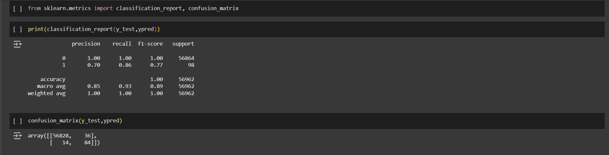

# Credit Card Fraud Detection | Random Forest Classifier

## Table of Contents
- Introduction
- Features
- Dataset
- How to Run
- Model & Performance Screenshots
- File Structure
- Limitations and Future Work
- License

## Introduction

This project focuses on detecting **credit card fraud** using machine learning techniques. It tackles the challenge of identifying fraudulent transactions in an imbalanced dataset, where the number of fraud cases is significantly lower than normal ones.

### 🎯 Problem It Solves
Financial fraud is a serious concern in digital transactions. Traditional detection systems often fail to catch rare fraud patterns. This project aims to build a model that can **accurately identify fraudulent transactions**, even with a heavy class imbalance.

### 🛠️ Technologies and Workflow
- **Python** for scripting and implementation
- **Pandas**, **NumPy** for data handling and preprocessing
- **Matplotlib** for visualizations
- **Scikit-learn** for model building and evaluation
- **SMOTE** (Synthetic Minority Over-sampling Technique) to handle class imbalance
- **Random Forest Classifier** for detection
- **Kaggle dataset** used for training and testing
- **Model training**, saving, and evaluation with metrics like confusion matrix and classification report
- **EDA** (Exploratory Data Analysis) to understand data distributions and feature relationships

The overall workflow includes data loading, EDA, handling imbalanced classes using SMOTE, training a Random Forest model, evaluating its performance, and saving the trained model for future use.

## Features

- Detects credit card fraud using real-world anonymized data
- Handles class imbalance with synthetic oversampling (SMOTE)
- Performs statistical analysis through EDA
- Trains a Random Forest model with strong interpretability
- Evaluates performance using precision, recall, and confusion matrix
- Saves the trained model for future use
- Clean, reproducible notebook with modular workflow

## Dataset

This project uses the **Credit Card Fraud Detection** dataset from Kaggle, which contains anonymized transactions made by European cardholders in September 2013.

- **Source**: [Kaggle - Credit Card Fraud Detection](https://www.kaggle.com/datasets/mlg-ulb/creditcardfraud?resource=download)
- **Total Records**: 284,807 transactions with 31 columns
- **Target Variable**: `Class`
  - `0` — Legitimate transaction
  - `1` — Fraudulent transaction
- **Features**:
  - 28 anonymized numerical features (`V1` to `V28`) obtained via PCA
  - `Time` — Seconds elapsed between each transaction and the first transaction
  - `Amount` — Transaction amount
- **Class Imbalance**:
  - Extremely imbalanced dataset
  - Only ~0.17% of transactions are fraudulent

The dataset was preprocessed and balanced using **SMOTE** before training the model.

## How to Run

You can open and run the notebook directly in Google Colab — no setup required.

## Model & Performance Screenshots

This project uses a **Random Forest Classifier** to detect fraudulent credit card transactions. 

### Why I used Random Forest over Logistic Regression ?
- Handles non-linear relationships and feature interactions effectively
- More robust to class imbalance 
- Often yields higher accuracy and recall on real-world tabular datasets

### Training and Evaluation
- The dataset was first balanced using **SMOTE (Synthetic Minority Oversampling Technique)**
- Data was split into an 80/20 train-test split with stratification
- Evaluation metrics include:
  - **Accuracy**
  - **Precision**
  - **Recall**
  - **F1 Score**
  - **Confusion Matrix**

### Model Results (on Test Set)
| Metric     | Value    |
|------------|----------|
| Accuracy   | 100%     |
| Precision  | 70% (Fraud class) |
| Recall     | 86% (Fraud class) |
| F1 Score   | 77% (Fraud class) |

> These scores reflect the model's ability to **effectively detect fraudulent transactions**, even with strong class imbalance.

### Confusion Matrix

|                         | Predicted: Not Fraud (0) | Predicted: Fraud (1) |
|-------------------------|--------------------------|-----------------------|
| **Actual: Not Fraud (0)** |        56,828            |         36            |
| **Actual: Fraud (1)**     |           14             |         84            |

This means:
- 84 true frauds were correctly identified
- 14 frauds were missed (false negatives)
- 36 normal transactions were incorrectly flagged as fraud (false positives)
- 56,828 normal transactions were correctly identified

Overall, the model performs well in identifying frauds while minimizing incorrect flags on legitimate transactions.

## File Structure

CreditCard-Fraud-Detection/
│
├── Credit_Card_Fraud_Detection.ipynb   # Main Jupyter notebook (Colab)
├── README.md                           # Project description and usage guide
├── .gitignore                          # Files/folders to ignore
├── .gitattributes                      # Git attributes (text encoding etc.)
│
└── images/
    └── classification_report.png       # Screenshot of model performance

## Limitations

- The dataset is highly imbalanced; although SMOTE was used, real-world imbalance may vary.
- Feature names are anonymized, limiting interpretability and domain-specific insights.
- The model is not integrated into a live system for real-time detection.
- Current approach lacks model explainability for flagged transactions.

## Future Work

- Deploy the model in a real-time fraud monitoring system.
- Incorporate additional contextual features like location, merchant type, and device ID.
- Experiment with advanced models (e.g., XGBoost, AutoML) and anomaly detection techniques.
- Apply explainability tools like SHAP or LIME to make model decisions transparent.

## 📄 License

This project is licensed under the terms of the [MIT License](LICENSE).

 
